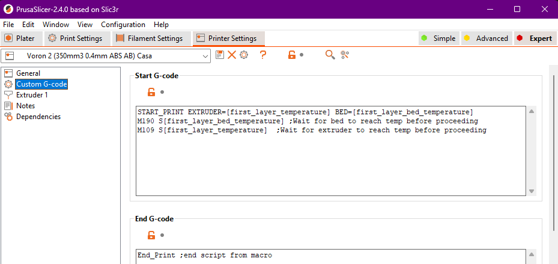

# Dove trovare i nomi delle variabili degli slicer

Utilizzando Klipper (ma anche altri firmware) mi risulta difficile trovare i nomi delle variabili che si possono usare negli slicer per personalizzare lo “Start g-code” .
Mi appunto qui alcuni nomi in modo da trovarli più facilmente.

Esploriamo tutti gli slicer più famosi:

- [Cura](http://files.fieldofview.com/cura/Replacement_Patterns.html)
- [Prusa Slicer](https://help.prusa3d.com/en/article/list-of-placeholders_205643)
- [Super Slicer](https://help.prusa3d.com/en/article/list-of-placeholders_205643)
- [Simplify 3D](https://forum.simplify3d.com/viewtopic.php?f=8&t=1959&p=7574)
- [Orca Slicer](https://forum.simplify3d.com/viewtopic.php?f=8&t=1959&p=7574)
- [Bambustudio](https://forum.simplify3d.com/viewtopic.php?f=8&t=1959&p=7574)

