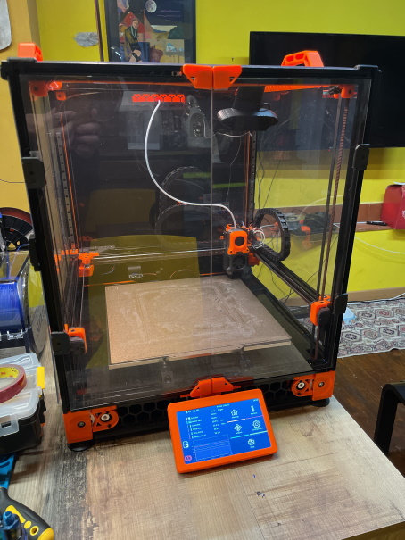
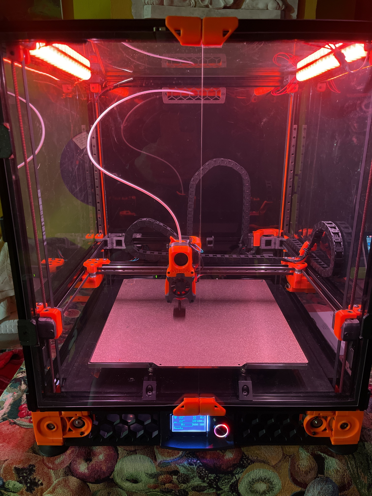
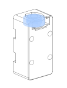
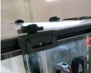
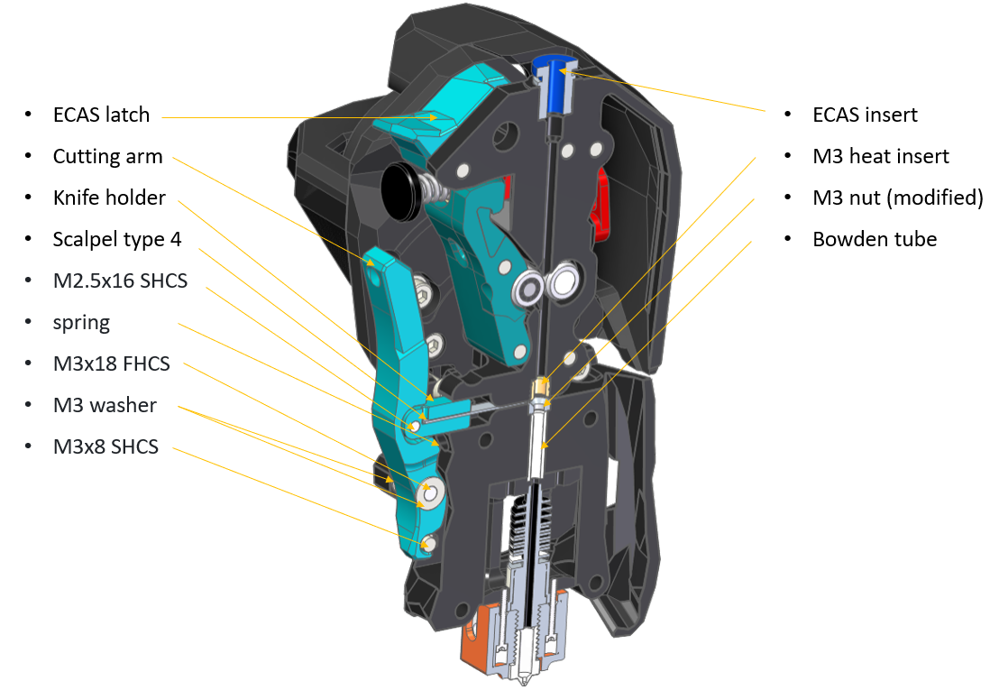

# Voron 2.4 - 350x350 

Iniziata originalmente con un kit FormBot:

!!! Struttura
    |||
    |:--------------|:------------------------------------------------------|
    |Scheda         | Spider 1.0                                            |
    |Comunicazione  | Can Bus con BTT UTC                                   |
    |Schermo        | BTT da 7"                                             |
    |CPU            | Rasperry PI 4                                         |
    |Struttura      | Profili 2020 Neri                                     |
    |               | Kit Metal sul gantry, motori AB e XY joint            |
    |               | Pannelli neri in DBond                                |
    |Piatto         | Magnetico nero ruvido                                 |
    |MMU            | Annex TradRack                                        |
    |Ventole        |                                                       |
    |Sensori Temperatura | |

!!! Testa
    |Tipo           |Descrizione                                            |
    |:--------------|:------------------------------------------------------|
    |Testa          | Stealthburner                                         |
    |ToolBoard      | Mellow RPI 2040 Pro                                   |
    |HotEnd         | Rapido 2 Plus                                         |
    |Sensore        | PT 1000                                               |
    |Sensore Piatto | TAP PPS CF                                            |
    |Comunicazione  | CanBus                                                |
    |Taglio Filo    | Filametrix                                            |
    |Ugello         | Slice Engineering                                     |
    |Ventole        |                                                       |

## Foto Gallery
{ width="48%" }
{ width="48%" }

## 
Lista MOD
 

#### Installate

- [Z GeC5C](https://github.com/VoronDesign/VoronUsers/tree/master/printer_mods/hartk1213/Voron2.4_GE5C)

    ---

    
{ width="100" }
 

- [Filament latch](https://github.com/richardjm/voron-parts/tree/main/voron-2.4/FilamentLatch)

    ---

    
{ width="180" }
 

- [270° Hinge - Parametric](https://github.com/VoronDesign/VoronUsers/tree/main/printer_mods/chrisrgonzales/270_degree_hinge)

    ---

    
{ width="180" }
 

- [Voron v2.4 Sturdy Handles](https://github.com/VoronDesign/VoronUsers/tree/main/printer_mods/jeoje/Sturdy_Handles)

    ---

    
{ width="180" }
 

- [7i Case](https://www.thingiverse.com/thing:4890092)

    ---

    
{ width="180" }
 

- [Filametrix](https://github.com/sorted01/Filametrix)

    ---

    
{ width="180" }
 

- [TradRack](https://github.com/Annex-Engineering/TradRack)

    ---

    
{ width="180" }
 

#### Archiviate

- [ERCF](https://github.com/EtteGit/EnragedRabbitProject)
- [Happy Hare](https://github.com/EtteGit/EnragedRabbitProject)
- [Porta LED](https://vector3d.autodesk360.com/g/shares/SH35dfcQT936092f0e43469304ebe68e1ebc)
- [Pins_Mod](https://github.com/VoronDesign/VoronUsers/tree/main/printer_mods/hartk1213/Voron2.4_Trident_Pins_Mod)

