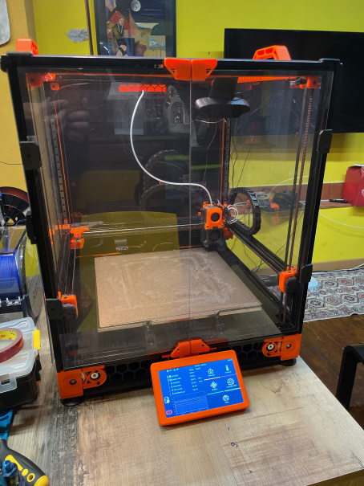
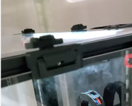
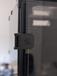

# Voron Trident - 250x250

Iniziata originalmente con un kit FormBot:

## Lista componenti

- Octopus Pro
- Driver 2209
- CAN BUS con BTT UTC
- Rasperry PI 4
- Display da 5"
- Kit Metal sul gantry, motori AB e XY joint
- Piatto ruvido nero
- Pannelli in DBond
- Giano

##### Testa:

- Stealthburner con filament cutter
- Mellow RPI 2040 Pro
- Rapido Plus
- TAP in Metal Caotic Lab

## Foto Gallery
{ width="48%" }
{ width="48%" }

## 
Lista MOD
 

#### Installate

- [Filament latch](https://github.com/richardjm/voron-parts/tree/main/voron-2.4/FilamentLatch)

    ---

    
{ width="180" }
 

- [270° Hinge - Parametric](https://github.com/VoronDesign/VoronUsers/tree/main/printer_mods/chrisrgonzales/270_degree_hinge)

    ---

    
{ width="180" }
 

- [Voron v2.4 Sturdy Handles](https://github.com/VoronDesign/VoronUsers/tree/main/printer_mods/jeoje/Sturdy_Handles)

    ---

    
{ width="180" }
 

- [Display mount 5"](https://mods.vorondesign.com/details/CwJMutvjRBnCEBVugq9ZLQ)

    ---

    
{ width="180" }
 

- [Filametrix](https://github.com/sorted01/Filametrix)

    ---

    
{ width="180" }
 

- [Nevermore](https://github.com/nevermore3d/Nevermore_Micro)

    ---

    
{ width="180" }
 

#### Archiviate

- [ERCF](https://github.com/EtteGit/EnragedRabbitProject)
- [Happy Hare](https://github.com/EtteGit/EnragedRabbitProject)
- [Porta LED](https://vector3d.autodesk360.com/g/shares/SH35dfcQT936092f0e43469304ebe68e1ebc)
- [Pins_Mod](https://github.com/VoronDesign/VoronUsers/tree/main/printer_mods/hartk1213/Voron2.4_Trident_Pins_Mod)

